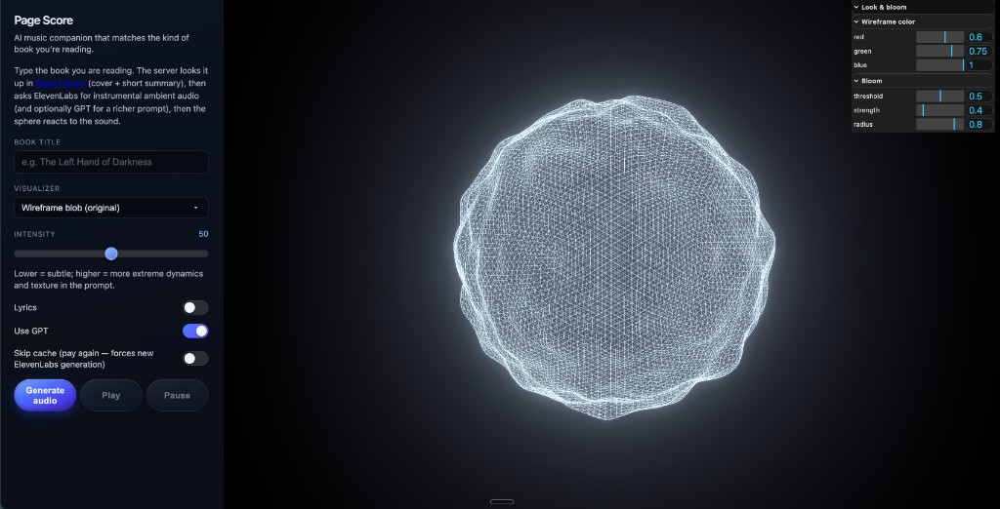

# Page Score

Page Score is an AI music companion for reading.

You type a book title, the app looks up book metadata from Open Library, builds a mood-aware music prompt, generates ambient audio, and visualizes it in a reactive 3D scene.



## What This App Does

- Takes a book title and finds the closest match in Open Library.
- Uses that metadata (themes, summary, era) to shape the music direction.
- Generates ambient audio with ElevenLabs.
- Optionally uses OpenAI to create a richer prompt and color palette.
- Plays the audio in a Three.js visualizer that reacts to sound.

## Tech Stack

- Frontend: React + Vite + TypeScript
- Backend API: Express + TypeScript
- 3D visuals: Three.js
- AI services: ElevenLabs Music (required), OpenAI (optional)
- Book metadata: Open Library

## Quick Start

### 1) Install dependencies

```bash
npm install
```

### 2) Create your local env file

Copy the example env file:

```bash
cp .env.example .env
```

Then open `.env` and set your keys:

- `ELEVENLABS_API_KEY` (required)
- `OPENAI_API_KEY` (optional, but improves prompt quality)
- `PORT` (optional, defaults to `3001`)

### 3) Run the app in development

```bash
npm run dev
```

This starts:

- Vite frontend dev server
- Express API server (`server/index.ts`)

By default, the UI is served at `http://localhost:5173` and API calls are proxied to the backend.

## Available Scripts

- `npm run dev` - run frontend + backend together in watch mode
- `npm run server` - run backend only
- `npm run build` - create a production frontend build
- `npm run preview` - preview the production frontend build locally
- `npm run typecheck` - run TypeScript checks

## How The Flow Works

1. You enter a book title in the UI.
2. The frontend calls `POST /api/ambient`.
3. The server:
   - looks up the book in Open Library,
   - builds a generation prompt (fallback or GPT-enriched),
   - requests audio from ElevenLabs.
4. The response returns:
   - base64 audio,
   - prompt used,
   - mood tags,
   - RGB color suggestions for the visualizer.
5. The frontend loads audio and updates the visualizer colors.

## Configuration Notes

- `.env` is ignored by git (safe for secrets).
- `.env.example` is commit-safe and documents required variables.
- If `OPENAI_API_KEY` is missing, the app still works using a fallback prompt strategy.

## Troubleshooting

- **No audio generated**: confirm `ELEVENLABS_API_KEY` is set in `.env`.
- **Prompt feels generic**: add `OPENAI_API_KEY` and enable "Use GPT" in the UI.
- **Port issues**: set a custom `PORT` in `.env` and restart dev mode.

## Project Structure

- `src/` - React app and visualizer code
- `server/` - Express API for prompt + music generation
- `docs/` - documentation assets (including the screenshot)

